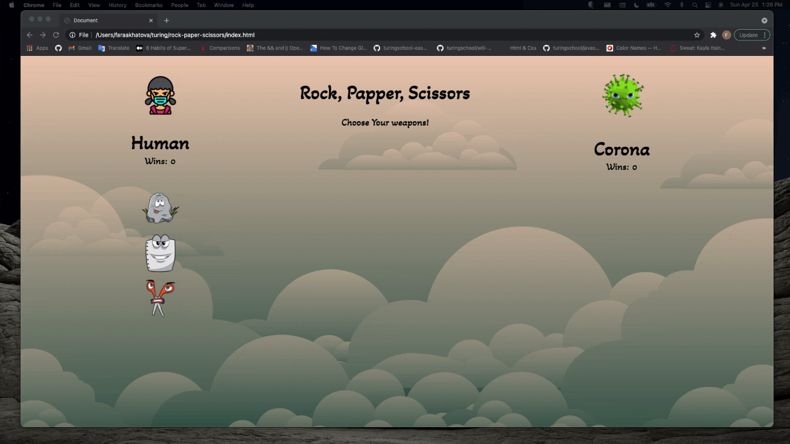

# Rock Paper Scissors

### Overal

Application Rock Paper Scissors is a game board where user plays agains computer.

Application has two types of the game: Classic and Advanced.

In both games `User` player fights agains `Computer` player.

### Classic:

- The game of Rock, Paper, Scissors is played like this: at the same time, two players display one of three symbols:

   a rock, paper, or scissors. A rock beats scissors, scissors beat paper by cutting it, and paper beats rock by covering it.

- Draw:

 If User player and Computer player chooses the same weapon, it is a Draw.

### Advanced:

- The game of Rock, Paper, Scissors, Spock, Lizard is played like this: at the same time, two players display one of three symbols:

 Scissors cuts paper, paper covers rock, rock crushes lizard, lizard poisons Spock, Spock smashes scissors, scissors decapitates lizard, lizard eats paper, paper disproves Spock, Spock vaporizes rock, and as it always has, rock crushes scissors.

- Draw:

 If User player and Computer player chooses the same weapon, it is a Draw.
***
### Instructions:

1. ##### Choose Game Type:

2. #####  Choose Weapon:

3. ##### You Win/Lose:

4. ##### Switch to different game:

5. ##### Play your weapon:

6. ##### You Win/Lose:

7. ##### Switch to different game:

8. ##### Refresh Page: Still your wins displayed:

***

### Why was this project created?
To solidify and demonstrate the understanding of:
1. Writing clean and DRY HTML, CSS, and JS
2. Understand the difference between the data model and how the data is displayed on the DOM
3. The class to class interactions
4. Implementation of client-side data persistence by utilizing JSON and localStorage

### Languages

1. HTML
2. CSS
3. JavasCript

### Reasources and Tools

1. Dev-tools
2. Google
3. Stack-Overflow
4. MDN Web Docs

### Reflection

Wins:

My biggest win is completing project before due date and be able to understand every line of code.

Challenges:

Hardest part is to be able understand what is data type and localStorage, be able to write winning conditions and make game fully implement class to class interactions.
***

### Author
* Farangiz Akhatova.

### Project Manager
* Will Mitchel

### Pages
